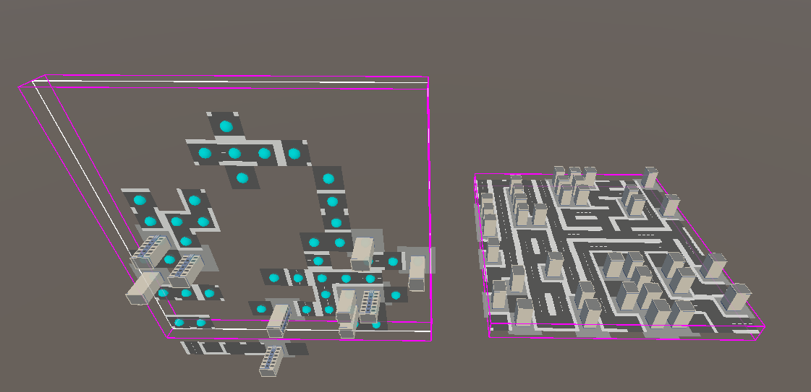

# 🎮 Journal d’avancement — Projet “Generative Worlds”

**Groupe : 8**
**Membres (2 ou 3 max): Ewan DURAND / Maxime KERVRAN**
**Thème choisi : Ville**

---

## 🧭 Objectif du projet

Créer un environnement procédural avec **Wave Function Collapse (WFC)** dans Unity,  
puis y intégrer des **mécaniques d’exploration ou d’interaction** permettant de modifier ou d’habiter cet environnement.

## 📚 Ressources

- [Tutorial WFC](https://www.procjam.com/tutorials/wfc/)
- [WFC Unity Plugin](https://selfsame.itch.io/unitywfc)
- [WFC initial plugin](https://github.com/mxgmn/WaveFunctionCollapse)

---

## 📅 Suivi jour par jour

### 🧩 Mardi matin – Mise en place

**Objectifs du jour :**

- Créer un projet Unity de base avec les dépendances nécessaires (WFC, VR/interaction).
- Choisir un style visuel et un type d’environnement à générer.
- Créer et rassembler les assets de base (tilesets, textures, modèles 3D).
- Comprendre le fonctionnement de base du plugin WFC sur Unity.
- Créer un premier exemple de génération simple.

## **Travail réalisé :** 
On a crée le projet Unity "Generation Worlds" avec WFC et on a récupéré un asset de ville afin de pouvoir commencer à travailler avec.

## **Résultats (captures ou description) :**

## **Problèmes rencontrés :**

## **Prochaines étapes :Réussir à générer un environnement avec WFC**

---

### 🧱 Mardi après-midi – Génération procédurale

**Objectifs du jour :**

- Créer un environnement cohérent à partir d’un *training sample*.
- Expérimenter différents paramètres (symétries, contraintes XML…).

## **Travail réalisé :**

- Utilisation de WFC expliqué dans le tutoriel pour générer un environnement

## **Résultats / captures :**

- Pour le moment la génération permet bien de faire apparaître une génération de tuiles en rapport avec l'entrainement donné  mais ce n'est pas tout à fait comme attendu

## **Problèmes rencontrés :**

- Le WFC ne parvient pas à générer correctement un envrionnement lorsqu'il y a trop de tuiles différentes utilisées dans l'entrainement et si le résultat et trop grand

## **Idées d’amélioration :Peut-être qu'avec les contraintes XML cela pourrait mieux fonctionner**

---

### 🧭 Mercredi après-midi – Interaction et navigation

**Objectifs du jour : Génération initiale de l'environnement avec WFC**

- Permettre la navigation dans l’environnement généré.
- Ajouter une ou plusieurs interactions. Exemples : modification de l’environnement, collecte d’objets, déclenchement d’événements.
- Gérer les modifications dynamiques de l’environnement (re-génération partielle, sauvegarde de l’état…) --> Utiliser les ressources données et les possibilités du plugin WFC.

## **Travail réalisé : Génération initiale fonctionnelle et prise en compte des prefabs 3D. Build fonctionnel sur le casque VR.**

## **Résultats / captures :**
- Génération en un seul bloc.
- 

## **Problèmes rencontrés :**

- Orientation des bâtiment parfois incorrecte.
- Inconvénient : impossible de re-générer seulement une portion de la carte.

## **Idées / pistes :**
- Génération : diviser l'espace pour modifier le contenu en mode d'interaction
- Navigation : Téléportation et Vol (pour l'édition en temps réel)
- Interaction : passage en mode édition -> sélection d'une portion (case) à modifier et possibilité d'y placer des contraintes sous la forme de tuiles fixes.

---

### 🎨 Jeudi après-midi – Finition et expérience utilisateur

**Objectifs du jour :**

- Donner une cohérence visuelle et interactive à l’expérience.
- Finaliser les éléments techniques et préparer la présentation.

## **Travail réalisé :**

## **Problèmes restants :**

## **Améliorations prévues :**

---

### 🎤 Vendredi après-midi – Présentation finale

## **Résumé du projet :**

## **Ce que nous avons appris :**

## **Ce que nous ferions différemment :**

## **Lien vers le projet Unity / dépôt :**

---

## 💬 Notes et réflexions libres

(Espace pour idées, croquis, remarques sur le WFC, les interactions, ou l’expérience utilisateur)
